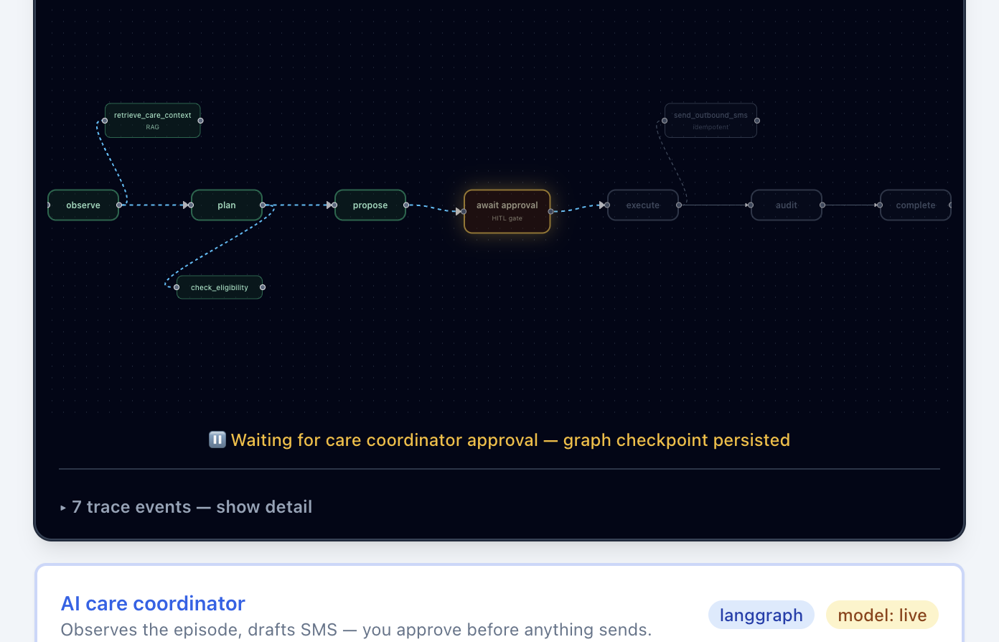
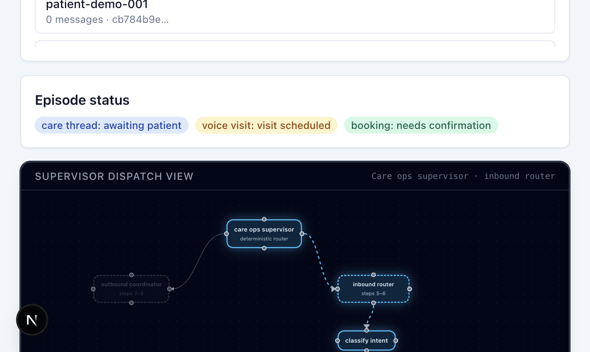
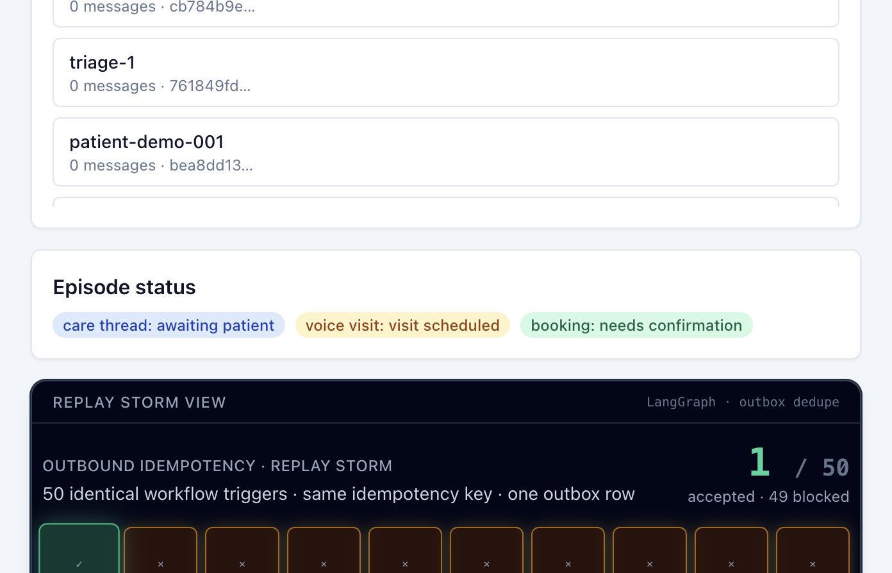

# Peerlist publish bundle

**Title:** Duplicate SMS Is a Clinical Failure Mode — Building Idempotency Before Agentic Care-Ops

**Subtitle:** A public rebuild of production invariants — LangGraph coordinator, webhook dedupe, and a 50× replay storm you can run in five minutes.

**Tags:** `healthtech` · `distributed-systems` · `idempotency` · `langgraph` · `nestjs` · `sms` · `agentic-ai`

**Peerlist summary (paste into editor):**

Clinical care-ops programs send two-way SMS around voice visits. When Twilio replays a webhook, a queue redelivers, or an LLM coordinator retries, duplicate texts erode patient trust — in healthcare, a second “your appointment is tomorrow” is a program failure, not a nuisance. I couldn't open-source production code from Ellipsis Health, so I rebuilt the invariants as a public demo: inbound SID upserts, outbound outbox keys, a LangGraph coordinator with human-in-the-loop approval, and a 50× replay storm you can click through in five minutes.

**Live demo:** https://care-ops-idempotency-demo.vercel.app  
**Repository:** https://github.com/sondo-amoeba/care-ops-idempotency-demo

**Images:** Upload the three PNGs from `docs/blog/assets/` when publishing (Peerlist editor does not pull from GitHub automatically).

---

# Duplicate SMS Is a Clinical Failure Mode — Building Idempotency Before Agentic Care-Ops

*A public rebuild of production invariants — LangGraph coordinator, webhook dedupe, and a 50× replay storm you can run in five minutes.*

---

In clinical SMS programs, duplicate sends are not a minor UX annoyance. They are a trust failure. A patient who receives two confirmation texts — or worse, two different appointment times — loses confidence in the care program itself. That is the bar I worked against in production care-ops at Ellipsis Health, where HIPAA-bound code could never be open-sourced.

So I rebuilt the **architecture** publicly: a runnable lab where engineering reviewers can click through replay-safe SMS orchestration without cloning a private repo. The thesis is simple: **agents make retries worse**. Before you add LLM coordinators, webhook classifiers, or RAG retrieval, you need write-path invariants that survive concurrent replay. Intelligence comes after dedupe — never before.

The live demo is here: [care-ops-idempotency-demo.vercel.app](https://care-ops-idempotency-demo.vercel.app). This post walks through what I shipped and why.

## The failure modes that multiply under agents

Care-ops SMS sits at a messy intersection:

- **Twilio webhooks replay.** Network timeouts, load balancer retries, and manual replays all re-deliver the same `MessageSid`.
- **Queue workers redeliver.** At-least-once semantics mean your handler may run twice unless the write path is idempotent.
- **Humans double-click.** Care coordinators approve, retry, or trigger sends from a console — often in the same clinical outreach window.
- **Agent workflows add a new retry surface.** An LLM coordinator that observes state, plans an action, and proposes an outbound SMS will be invoked again on lifecycle signals, manual reruns, and test harnesses. Each invocation is another chance to duplicate a send.

In production, the invariant target was duplicate delivery under 0.1%. The demo makes that visible: fire fifty identical outbound triggers and watch them collapse to one persisted row.

## Three invariants before intelligence

Every interesting feature in this repo — the AI outbound coordinator, the inbound intent router, the supervisor dispatch layer — sits **on top of** three write-path guarantees.

### 1. Inbound: upsert on Twilio MessageSid

Twilio gives you a stable `MessageSid` per message. The inbound handler looks up that SID first. If it already exists, the handler updates the row and returns `duplicate: true`. No second insert. No downstream routing.

```typescript
// apps/api/src/webhooks/webhooks.controller.ts
@Post("inbound")
async inbound(@Body() dto: InboundWebhookDto) {
  const persisted = await this.sms.handleInbound(dto);
  if (persisted.duplicate) {
    return persisted; // supervisor never runs on replay
  }
  const routing = await this.supervisor.handleInbound(
    dto.interactionId,
    dto.Body,
  );
  return { ...persisted, ...routing };
}
```

This ordering is deliberate. **Intelligence never precedes idempotency.** The inbound router that classifies "can we move to Thursday?" as a reschedule request only runs on a *new* SID. Replays are cheap, safe, and boring — exactly what you want from a webhook handler.

### 2. Outbound: outbox + hour window + ON CONFLICT

Outbound sends compute a deterministic idempotency key from the interaction, template, and the start of the current hour:

```typescript
// apps/api/src/common/idempotency.util.ts
export function buildIdempotencyKey(
  interactionId: string,
  templateId: string,
  windowStart: string,
): string {
  return createHash("sha256")
    .update(`${interactionId}:${templateId}:${windowStart}`)
    .digest("hex")
    .slice(0, 32);
}
```

The hour window buckets retries within the same clinical outreach period while allowing a fresh reminder in the next hour — a compromise between strict dedupe and operational flexibility.

The outbox insert is the persistence authority. Concurrent replays race on `INSERT … ON CONFLICT DO NOTHING`; only the winning insert creates the `sms_messages` row:

```typescript
// apps/api/src/sms/sms.service.ts (abbreviated)
INSERT INTO sms_outbox
  ("idempotencyKey", "interactionId", "templateId", body, status, ...)
VALUES ($1, $2, $3, $4, 'sent', ...)
ON CONFLICT ("idempotencyKey") DO NOTHING
RETURNING id
```

No distributed locks. No check-then-insert race window. Redis handles rate limiting, but Postgres owns dedupe — Redis eviction must never be the authority for whether a clinical SMS was sent.

### 3. Status callbacks: update-only

Late Twilio delivery events (`delivered`, `failed`) update an existing message row. They never insert a new one. This sounds obvious until you have seen a status callback create a phantom inbound row because the handler treated every webhook as a new event.

Together, these three paths form the floor. Everything agentic builds on top.

## Architecture at a glance

```
Browser (Vercel)
  → Next.js care coordinator console
       ↓ proxy /care-ops/* and /webhooks/*
  → NestJS API (Render)
       ↓
  PostgreSQL (Neon + pgvector)     Redis (Upstash)
       │                                    │
  interactions · sms_outbox ·               rate limits
  coordinator_* · care_context_chunks     LangGraph checkpoints
```



```mermaid
flowchart TB
  subgraph inbound["Inbound path"]
    WH["Twilio webhook"] --> SID["SID upsert"]
    SID -->|duplicate| RET["Return early"]
    SID -->|new| SUP["Care ops supervisor"]
    SUP --> IR["Inbound router"]
    IR --> CONF["confirmFromInbound"]
    IR --> HITL["HITL proposal"]
  end

  subgraph outbound["Outbound path"]
    TRIG["Trigger: human / workflow / coordinator"] --> ELIG["Eligibility gate"]
    ELIG --> OUT["Outbox INSERT ON CONFLICT"]
    OUT --> MSG["sms_messages row"]
  end

  subgraph coord["Coordinator path"]
    OBS["observe + RAG"] --> PLAN["plan (Gemini or mock)"]
    PLAN --> PROP["propose"]
    PROP --> APP["await_approval — graph interrupt"]
    APP --> EXEC["execute → sendOutbound"]
    EXEC --> OUT
  end

  SUP -->|lifecycle / manual| coord
```

The split stack (Vercel for UI, Render for API, Neon for Postgres, Upstash for Redis) keeps the demo at $0/month while still feeling production-shaped. A GitHub Actions keep-warm workflow pings the API every ten minutes so Render free-tier cold starts do not ruin a live walkthrough.

## Agentic outbound — without bypassing the outbox

Once idempotent writes exist, you can add an LLM-driven **outbound coordinator** that proposes care-ops SMS actions. The coordinator never sends during planning. Side effects flow only through the graph's `execute` node, after human approval, through the same `sendOutbound` path as every other trigger.

The graph is a LangGraph state machine:

```typescript
// apps/api/src/coordinator/outbound-coordinator-graph.runner.ts (topology)
.addEdge(START, "observe")
.addEdge("observe", "check_eligibility")
.addConditionalEdges("check_eligibility", (state) =>
  state.status === "ineligible" ? "ineligible" : "plan",
)
.addEdge("plan", "propose")
.addEdge("propose", "await_approval")
.addEdge("await_approval", "execute")
.addEdge("execute", "audit")
// compiled with interruptBefore: ["execute"]
```

Key properties:

- **HITL is structural, not cosmetic.** `interruptBefore: ["execute"]` means the graph pauses at approval. On Render's free tier, services sleep after idle; a coordinator run may wait minutes for a human. Checkpoints persist in Postgres — in-memory state would not survive a cold start.
- **The LLM never gets write tools during plan.** Read-only tools (`get_interaction_state`, `check_eligibility`, `list_messages`, `retrieve_care_context`) wrap domain services. `send_outbound_sms` is execute-only, post-approval.
- **`duplicate: true` is a valid outcome, not an error.** If execute hits an existing outbox key, the run still reaches audit. Replay storms through the coordinator collapse to one row — the same invariant as the deterministic workflow trigger.
- **Mock and live adapters share the same graph.** CI runs mock mode (no Gemini calls). With `GEMINI_API_KEY`, Gemini plans structured proposals; on quota or API errors, the graph falls back to mock for that run and records `liveAttempted: true` in the trace.

The console streams coordinator trace events over SSE (`phase`, `tool`, `proposal`, `interrupt`, `complete`) and renders them in a React Flow graph that highlights the active node as the run progresses.



## Bidirectional care-ops: supervisor + inbound router

Production care-ops is not outbound-only. Patients reply YES, ask to reschedule, or opt out. ADR-0002 dedupes inbound webhooks, but something still has to classify intent and route side effects.

I added a **care ops supervisor** — a deterministic router, no LLM — that dispatches to specialist graphs by signal type:

| Signal | Specialist |
|--------|------------|
| `lifecycle` / `manual` | Outbound coordinator |
| `inbound` (new message, post-SID-upsert) | Inbound router |

The inbound router classifies body text into patient intent (`CONFIRM`, `RESCHEDULE`, `OPT_OUT`, `UNKNOWN`) and routes accordingly. `CONFIRM` flows through the same deterministic `confirmFromInbound()` handler when scheduling eligibility passes. `RESCHEDULE` and `UNKNOWN` create outbound coordinator proposals for human approval — reusing the same proposal, approval, and execute machinery.

RAG is a shared read tool, not a conversational agent. Synthetic program policy chunks live in Postgres with pgvector embeddings (deterministic hash vectors — no embedding API, CI equals production). The coordinator trace logs retrieved chunk IDs so reviewers can see policy context influencing proposals without a separate "chat with your policies" UI.



## Proof: the replay storm

The demo's hero moment is step 4 of the guided walkthrough: **50× replay storm**. The UI fires fifty concurrent identical outbound triggers — through the coordinator's approved execute path or the deterministic workflow orchestrator — and animates the results:

- Attempt ticks stagger in real time, driven by actual API responses
- Duplicates flash amber and collapse
- One accepted row locks green
- Final frame shows accepted/blocked ratio tied to activity log numbers



Vitest covers the same scenario under parallel load. A shell script (`scripts/replay-storm.sh`) runs it headless for CI. The point is not the animation — it is that **the invariant holds under the retry patterns agents introduce**, not just under polite sequential tests.

## Five-minute walkthrough

If you open the live demo, the console guides you through two tiers:

**Tier 1 (steps 1–4) — the five-minute pitch**

1. Start a new care thread (interaction + voice session + booking bundle)
2. Run the AI coordinator — trace fills; proposal appears at `await_approval`
3. Approve — one outbound SMS via the idempotent outbox
4. Replay storm — fifty triggers, one persisted row

**Tier 2 (steps 5–6) — bidirectional orchestration**

5. Simulate patient YES — inbound router confirms booking, completes voice, resolves thread
6. Simulate reschedule request — supervisor dispatches inbound router → HITL proposal

Architecture lab controls (manual sends, webhook replays, eligibility toggles) sit beneath the walkthrough, visually subordinate — there for reviewers who want to probe, not for cold-first-load overwhelm.

## What I deliberately did not ship

Transparency matters for a public lab:

- No auth, multi-tenant programs, or real Twilio signature validation
- No PHI, live Twilio, or HIPAA audit logging
- `synchronize: true` for demo schema — migrations in production
- Coordinator defaults to mock on Render unless `GEMINI_API_KEY` is set
- Inbound classification is deterministic (keyword/regex), not LLM — Gemini applies only to outbound plan

These cuts keep the demo deployable at $0 and the narrative focused. The architecture decisions (outbox authority, graph interrupt, SID-before-supervisor) are the parts that transfer to production.

## Closing

The order of operations I would recommend for any team adding agents to a messaging pipeline:

1. **Make writes replay-safe** — stable keys, conflict-safe inserts, update-only callbacks
2. **Route intelligence after dedupe** — never classify or plan on a replay
3. **Enforce HITL in the execution graph** — not as a UI convention
4. **Prove invariants under load** — parallel replay tests, not just happy-path unit tests
5. **Then** add coordinators, routers, and retrieval

This repo is an illustrative lab, not production Ellipsis or Solace code. No PHI, no live Twilio. But the invariants are the ones I shipped against in private — rebuilt so you can break them in public and watch them hold.

**Try it:** [care-ops-idempotency-demo.vercel.app](https://care-ops-idempotency-demo.vercel.app)  
**Source:** [github.com/sondo-amoeba/care-ops-idempotency-demo](https://github.com/sondo-amoeba/care-ops-idempotency-demo)

---

*MIT licensed. Fictional patient IDs only.*
